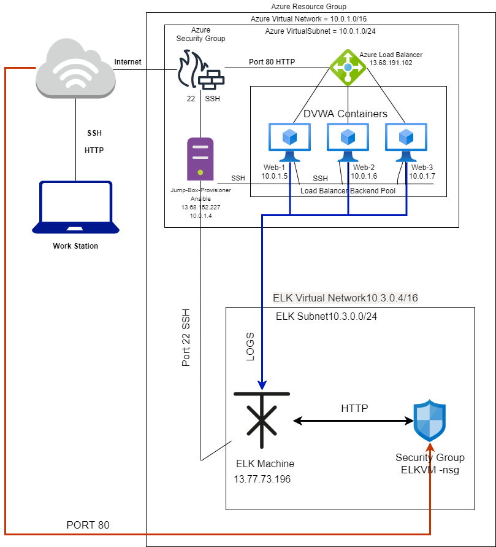
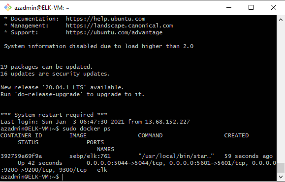

## Automated ELK Stack Deployment

The files in this repository were used to configure the network depicted below.

These files have been tested and used to generate a live ELK deployment on Azure. They can be used to either recreate the entire deployment pictured above. Alternatively, select portions of the file may be used to install only certain pieces of it, such as Filebeat.

This document contains the following details:
- Description of the Topology
- Access Policies
- ELK Configuration
  - Beats in Use
  - Machines Being Monitored
- How to Use the Ansible Build

### Description of the Topology

The main purpose of this network is to expose a load-balanced and monitored instance of DVWA, the Damn Vulnerable Web Application.

Load balancing ensures that the application will be highly available, in addition to restricting unwanted traffic to the network.
- What aspect of security do load balancers protect? What is the advantage of a jump box?_
It defends and organization against distributed DDoS attacks.
When a jump box is used, it;s hidden benefit is that any tools in place for the storage area network system are maintained on that single system.

Integrating an ELK server allows users to easily monitor the vulnerable VMs for changes to the metrics and system files.
- What does Filebeat watch for?
Filebeat monitors the log files or locations that you specify.
- What does Metricbeat record?
Metricbeat take the metrics and statistics that it collects and ships them to the ELK VM.

The configuration details of each machine may be found below.
_Note: Use the [Markdown Table Generator](http://www.tablesgenerator.com/markdown_tables) to add/remove values from the table_.

| Name     | Function | IP Address | Operating System |
|----------|----------|------------|------------------|
| Jump Box | Gateway  | 13.68.152.227   | Linux            |
| WEB-1     | DVWA  | 10.0.1.5 |   Linux   |                  |
| WEB-2    |  DVWA   |10.0.1.6 |  Linux     |
| WEB-3    |  DVWA    |  10.0.1.7|     Linux     |
| ElkVM    | Review Logs |10.3.0.5  | Linux |

### Access Policies

The machines on the internal network are not exposed to the public Internet. 

Only the Jumpbox machine can accept connections from the Internet. Access to this machine is only allowed from the following IP addresses:
- Add whitelisted IP addresses
184.145.55.61

Machines within the network can only be accessed by Jumpbox.
- Which machine did you allow to access your ELK VM? What was its IP address?
Jumpbox. 13.68.152.227

A summary of the access policies in place can be found in the table below.

| Name     | Publicly Accessible | Allowed IP Addresses |
|----------|---------------------|----------------------|
| Jump Box | Yes    |  184.145.55.61  |
|  WEB-1 |   NO          |  10.0.1.5/24  |
|  WEB-2   |   NO             |10.0.1.6/24 |
|  WEB-3 | NO | 10.0.1.7/24
|  ElkVM | NO | 10.3.0.5/24

### Elk Configuration

Ansible was used to automate configuration of the ELK machine. No configuration was performed manually, which is advantageous because...
- What is the main advantage of automating configuration with Ansible?
Automation will configure computers faster and avoid errors. We can also update configurations easily.

The playbook implements the following tasks:
- install docker.io
- install pip3
- install docker python module

The following screenshot displays the result of running `docker ps` after successfully configuring the ELK instance.

### Target Machines & Beats
This ELK server is configured to monitor the following machines:
- List the IP addresses of the machines you are monitoring
10.0.1.5-7

We have installed the following Beats on these machines:
- filebeats

These Beats allow us to collect the following information from each machine:
- Filebeat collects changes in the system files especially APACHE logs.

### Using the Playbook
In order to use the playbook, you will need to have an Ansible control node already configured. Assuming you have such a control node provisioned: 

SSH into the control node and follow the steps below:
- Copy the Playbook file to ansible.
- Update the ansible file to include the ips of our vms.
- Run the playbook, and navigate to ELK to check that the installation worked as expected.

_TODO: Answer the following questions to fill in the blanks:_
- _Which file is the playbook? Where do you copy it?_
Its is the pentest.yml file. You copy it to the ansible.
- _Which file do you update to make Ansible run the playbook on a specific machine? How do I specify which machine to install the ELK server on versus which to install Filebeat on?
You update the FilebeatPlaybook.yml to make ansible run the playbook on a specific machine. By specifying the ips in the host file.
- _Which URL do you navigate to in order to check that the ELK server is running?
http://52.251.63.32:5601/app/kibana#/home
_As a **Bonus**, provide the specific commands the user will need to run to download the playbook, update the files, etc._
navigate to etc/ansible (cd etc/ansible)
ansible-playbook FilebeatPlaybook.yml (To update files to load the filebeat).
